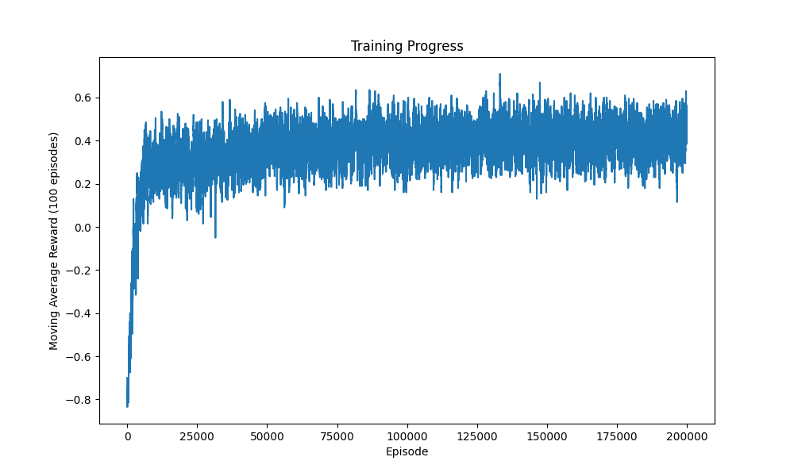

This project is a Python-based implementation of a Tic-Tac-Toe game where the computer player is an intelligent agent trained using **Q-learning**, a model-free reinforcement learning algorithm. 
The agent learns to play the game by playing thousands of games against a semi-intelligent opponent, eventually developing an optimal strategy to win or draw.

## Technical Breakdown

The project is built around the principles of reinforcement learning, where an agent learns to make optimal decisions by interacting with an environment and receiving rewards.

### 1. The Environment

The game logic is managed by the `TicTacToe` class in `environment.py`. The environment is responsible for:
* Representing the 3x3 board as a NumPy array.
* Tracking the state of the game (e.g., whose turn it is, whether the game is over).
* Providing a list of valid moves.
* Distributing rewards based on the outcome of a move:
    * **Win**: +1
    * **Draw**: +0.5
    * **Loss**: -1
    * **Invalid Move**: -0.5

### 2. The Agent

The `QLearningAgent` class in `agent.py` is the brain of the AI. It uses a **Q-table**, which is a dictionary that maps each possible board state to an array of values (Q-values) for each of the 9 possible moves. The agent's goal is to learn the Q-values that maximise its total reward.

During training, the agent uses an **epsilon-greedy** policy to balance exploration (making random moves to discover new strategies) and exploitation (choosing the best-known move).

### 3. The Training Process

The training is handled by the `train.py` script. The agent plays 200,000 games against a "smarter opponent" that will win if it has a winning move and block the agent if it is about to win.

To ensure the agent learns a robust strategy, the starting player is randomised for each game. This forces the agent to learn how to play as both the first and second player. After training, the learned Q-table is saved to `q_table.pkl`.

## Training Results

The graph below shows the agent's moving average reward over the course of the training. The agent successfully converges on an optimal strategy, where the average reward stabilises, indicating it has learned to consistently force a draw or win against its opponent.



## How to Use

### Prerequisites
* Python 3
* NumPy
* Matplotlib
* Pygame

You can install the required packages using:
```bash
pip install numpy matplotlib pygame
```
1. Train the Agent

To train the agent and generate the q_table.pkl file, run the training script from the project's root directory:
```bash
python -m RL_tictac_game.train
```
2. Play the Game

To play against the trained agent, run the GUI script:
```bash
python play_gui.py
```